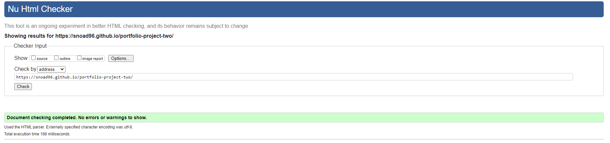

<h1> The Deadpool Quiz</h1>

[view the live project here!](https://snoad96.github.io/portfolio-project-two/)

The Deadpool Quiz is an interactive website that allows users to join a quiz based on the movie famous and comic character "Deadpool". It is a simple but intreresting game that is user friendly and even a little informative for the user.
The Website has been built to be fully responsive across all devices but is essentially a mobile quiz game.

## Index - Table of Contents
* [Purpose](#purpose)
* [User-Experience](#user-experience)
* [Features](#features)
* [Design](#design)
* [Technologies-Used](#technologies-used)
* [Testing](#testing)
* [Deployment](#deployment)
* [Credits](#credits) 

## Purpose

The purpose of the website is to produce a user-friendly quiz game dedicated to Deadpool. Being engaging and educational while also being replayable for the users that didn't get it right the first time.  

## User-Experience
I wanted the website to be aesthetically pleasing while using colours that are related to the Deadpool character. I wanted to keep the design minimal to not overwhelm the user while still being enjoyable to look at.
I wanted the user to be able to jusmp straight into the quiz with minimal navigation or extra pages blocking their path.

## Features

### Potential Future Features

- A Timer  
      - A running timer during the activity could add some pressure and excitment to the challenge. Making the user more likely to continue replayability.

- Online Leaderboard
      - I would like to make the Leaderboard work and host online, this would connect more users and add even more challenge once more questions were added.

- Contact the Developer
      - This would be a way that the user could give more ideas on extra questions, or a way for them to report any bugs that they may have found.

## Design

### Colour
- I decided to use a very simple style and go with the colours related to the main character of the quiz. These are big redish colours and of course black. Very basic but they work well together and I felt that not much other colours where needed for this quiz to stand out.

- I downloaded the main logo of my website and added it as an image to [Coolers](https://coolers.co/) and it generated a palate for me to use that were similar to the logo.
This kept the theme of the quiz throughout my website.

### Fonts/Typography
Throughout this website I decided to use the Merriweather font from [Google Fonts](https://fonts.google.com/). This was done as it creates an almost serious tone to the words even though it is a fun and silly quiz. This juxtaposition was what I had in mind when creating some of the smaller parts.

### Initial Wireframe Plans

- Originally I was going to have a Yes/No type quiz about Deadpool, So when it was drawn up on paper initially, it looked similar to how it turned out in the end product.

I was always planning on going with the colour scheme you see on the website, I think it turned out well.

## Technologies Used

### Languages Used

- [HTML5](https://en.wikipedia.org/wiki/HTML5)
- [CSS3](https://en.wikipedia.org/wiki/Cascading_Style_Sheets)
- [Javascript](https://en.wikipedia.org/wiki/Javascript)

### Programmes Used

-   [Google Fonts](https://fonts.google.com/)
      - Used to import specific fonts.
-   [Font Awesome](https://fontawesome.com/)
      - Used to add icons.
-   [GitHub](https://github.com/)
      - Used as the respository for the project code after being pushed from Git.
-   [W3C Markup Validation Service](https://validator.w3.org/)
      - Used to validate HTML.
-   [W3C CSS Validation Service](https://jigsaw.w3.org/css-validator/)
      - Used to validate CSS.
-   [JSHint](https://jshint.com/)
      - Used to validate Javascript.
-   [Coolors](https://coolors.co/)
      - Used to source a colour palette that would link to the purpose of the site and support the overall UX.
-   [Techsini](https://techsini.com/multi-mockup/index.php)
      - Used to create mockup images of my live website on different types of devices and viewports.

## Testing

### Validator Testing

#### HTML

- Using the [W3C Markup Validation Service](https://validator.w3.org/) it has come back with no errors or warnings. This was used for the whole website.

#### CSS

- the result from [W3C Markup Validation Service](https://validator.w3.org/) show no errors.

#### JavaScript

- Results from [JSHint](https://jshint.com/) I struggled a little with this Validator as I was unaware of the ES6 issue. I have since updated the top of my JavaScript pages with "// jshint esversion: 6" and has fixed the warning that were coming up.
It now shows no errors.

### Lighthouse Testing

### Browser Combatibility

Testing was done on
- Google Chrome
- Microsoft Edge
- Safari

### User Testing
- I have got multiple users to test out my website, all came back with a functional quiz. However I did have some issues come up and have since corrected them. 

### Resolved Bugs
- The leaderboard page would throw a 404 error once I put the website live, this was a simple misstype in the code.
 I have since corrected that.
- I also had an issue with the JS validator, showing warnings about "jshint esversion: 6", this was a new one for me and took a while to figure out.
With the help of my mentor and the slack community I was able to resolve this.

### Unresolved Bugs
- When I look at the website through my mobile device, I notice that it is not properly aligned, I am aware of this and going through it with my mentor, we do not understand why under 320px the information is no longer centered sometimes.
 With more time and better understanding of coding, I hope I will be able to resolve this issue.

## Deplyment

- To succsessfully deploy your webpage, go to the GitHub repository and navigate to the 'Settings' tab. Then, select 'Pages' from the menu.
- Go to the 'Source' menu and select 'Master Branch'.
- After the page has auto-refreshed, you should see a display with your link - this will mean a successful deployment.
- Now, any changes pushed from GitPod to the master branch will be visible and take effect on the live project [live project link](https://snoad96.github.io/portfolio-project-two/)

## Credits

### Photos/Images
The only Image I have used in my website is one taken from [seeklogo](https://seeklogo.com/free-vector-logos/deadpool) I used this from google images as it is a free site that allows you to download. 
I could not create my own as this is a TradeMark logo of the Deadpool franchise.

### Code/ Acknowledgements
- I have recieved help from multiple sources to create this webpage. 
      There is a lot on this website that I didn't learn or fully understand through the course material. 
      These are the people or sites that have helped me or gave me the ideas to create what I have produced.
- [Mike Dane Youtube Channel](https://www.youtube.com/c/GiraffeAcademy) 
      He has helped a lot with reminders and explaining more indepth about the areas I struggled more with.
- [W3Schools](https://www.w3schools.com/js/js_string_methods.asp)
      As a general reminder of what things mean and how to use them.
- [stack Overflow](https://stackoverflow.com/questions/74425069/merging-string-lists)
      For general questions that I struggled to find the answer for.
- The Slack Community, always someone with more knowledge than me.
      
- My mentor Spence for giving good guidlines and making sure I'm staying on track and not over complicating things.
